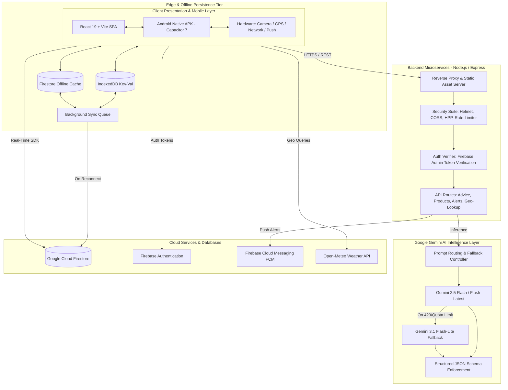

<div align="center">

# 🌱 VIONEX — Enterprise Smart Agriculture & Crop Advisory Platform

**A resilient, full-stack Agritech ecosystem combining Google Gemini AI, 100% offline-first architecture, and cross-platform native Android mobile delivery.**

[](https://react.dev/)
[](https://www.typescriptlang.org/)
[](https://nodejs.org/)
[](https://expressjs.com/)
[](https://firebase.google.com/)
[](https://deepmind.google/technologies/gemini/)
[](https://capacitorjs.com/)
[](https://tailwindcss.com/)

[Architecture](#-system-architecture) • [Engineering Highlights](#-engineering-highlights) • [Tech Stack](#-technology-stack) • [API Reference](#-api-specifications) • [Security & RBAC](#-security--role-based-access-control-rbac) • [Getting Started](#-getting-started)

</div>

---

## 📌 Executive Summary

**VIONEX** is a production-grade Smart Agriculture platform engineered to solve critical bottlenecks in agricultural advisory, farm management, and supply chain coordination. Designed specifically for low-bandwidth rural environments, VIONEX bridges the gap between field farmers, agronomists, and agrochemical consultants.

The platform provides **automated AI crop diagnosis**, **dynamic weather alerts**, **customized spray/fertilizer schedules**, **semantic product discovery**, and **comprehensive farmer record management** — accessible both as a Progressive Web App (PWA) and as a compiled native Android application.

### Why VIONEX Stands Out (Key Metrics)
- ⚡ **Zero-Latency Offline-First Performance**: 100% functional without internet connectivity via dual-layer caching (IndexedDB + Cloud Firestore Local Persistence).
- 🧠 **Resilient Gemini AI Engine**: Automated multi-tier fallback between Gemini models ensuring 99.9% AI advisory uptime even during upstream API rate limits.
- 📱 **Native Android Delivery**: Compiled via Capacitor 7 with full access to hardware cameras (leaf pest capture), GPS geolocation (weather geofencing), and push notifications.
- 🛡️ **Enterprise Security & Granular RBAC**: Multi-role permission system (Admin, Manager, Consultant, Sales, Farmer) with document-level ownership enforcement at both UI and Firestore security rule layers.

---

## 🏗️ System Architecture

VIONEX utilizes a modern multi-tier hybrid architecture that decouples client rendering and offline operations from cloud microservices and AI intelligence:



---

## 🚀 Engineering Highlights

### 1. 100% Offline-First Architecture (Zero "Page Unresponsive")
In rural farming hubs, cellular connectivity frequently drops between 2G, 4G, or zero signal. Traditional web applications hang or crash with blank screens.
- **Dual-Layer Persistence**: All dashboard metrics, crop schedules, farmer records, and product registries are stored locally using `idb-keyval` (IndexedDB) and Cloud Firestore's persistent offline cache.
- **Optimistic UI Updates**: All write operations (creating schedules, updating farmer profiles) commit locally in `0ms` and queue for automatic background synchronization the moment connectivity returns.
- **Self-Healing API Calls**: Every network request implements hard timeouts, exponential backoff, and circuit-breaker fallbacks, preventing thread locking and eliminating "Page Unresponsive" errors.

### 2. Self-Healing Multi-Tier Gemini AI Engine
Agricultural decision-making requires instant recommendations. If an AI provider encounters rate limits (HTTP 429) or transient server hiccups (HTTP 503), farmers cannot be left waiting:
```typescript
// Architectural Pattern: Multi-Tier Resilient AI Inference
const modelsToTry = isQuotaRestricted 
  ? ["gemini-3.1-flash-lite", "gemini-2.5-flash", "gemini-flash-latest"]
  : ["gemini-2.5-flash", "gemini-flash-latest", "gemini-3.1-flash-lite"];

for (const modelName of modelsToTry) {
  try {
    return await ai.interactions.create({ model: modelName, ...params });
  } catch (err) {
    if (isTransientOrQuota(err)) continue; // Graceful, transparent failover
    throw err;
  }
}
```
- **Automatic Fallback**: Transparently cascades requests across model tiers without interrupting the user's active session.
- **Strict Structured JSON Schema**: System instructions enforce strict typed schema output (`Type.OBJECT`, `Type.ARRAY`), eliminating parsing failures.
- **Multilingual Localization**: Native prompt engineering tailored for both Marathi (मराठी) and English agronomy queries.

### 3. Granular Role-Based Access Control (RBAC) & Ownership Security
VIONEX enforces enterprise-grade security at both the backend application and the database rules level:
- **Roles Matrix**: `Admin` (full system oversight), `Manager`, `Consultant` (agronomy advisor), `Sales`, `Farmer`, and `Viewer`.
- **Document-Level Ownership Sandbox**:
  - Consultants can **read** all farmer records to check history, prevent duplicate enrollments, and coordinate schedules.
  - Consultants can **strictly edit and delete ONLY** the farmer records they personally created (`farmer.createdBy === auth.currentUser.uid`).
  - Implemented client-side in React UI and enforced cryptographically in `firestore.rules`:
    ```javascript
    match /farmers/{farmerId} {
      allow read: if isSignedIn();
      allow update, delete: if isAdmin() || (
        isConsultant() && 
        resource.data.createdBy == request.auth.uid &&
        request.resource.data.createdBy == resource.data.createdBy
      );
    }
    ```
- **Isolated Secondary App Auth Creation**: Creating new consultant and manager accounts from the admin dashboard uses an isolated secondary Firebase App instance, ensuring the logged-in administrator is never inadvertently logged out during account provisioning.

### 4. Native Android Compilation (Capacitor 7)
- Embedded WebView communicating with native Android subsystems via Capacitor plugins.
- Android Manifest permissions configured for `INTERNET`, `CAMERA` (leaf photo diagnosis), `ACCESS_FINE_LOCATION` (weather coordinates), and `POST_NOTIFICATIONS` (real-time spray alerts).
- Produces a production-ready, lightweight APK (~10.2 MB) optimized for low-spec Android devices (2GB–3GB RAM).

---

## 🛠️ Technology Stack

| Domain | Technology / Library | Version | Role in Architecture |
| :--- | :--- | :--- | :--- |
| **Frontend Core** | **React** | `19.0` | Declarative UI rendering, hooks, concurrent features |
| **Language** | **TypeScript** | `5.8` | Static typing, compile-time safety across frontend & backend |
| **Build & Bundler** | **Vite** | `6.2` | Fast HMR, code splitting, production minification |
| **Styling** | **Tailwind CSS** | `4.1` | Utility-first, responsive, dark/light theme styling |
| **Icons & Motion** | **Lucide React & Motion** | Latest | Modern iconography and fluid micro-animations |
| **Local Storage** | **idb-keyval (IndexedDB)** | `6.3` | Ultra-fast client-side key-value persistence |
| **Mobile Runtime** | **Capacitor Android** | `7.0 / 8.4` | Native Android bridge, Gradle integration, hardware APIs |
| **Backend Framework**| **Express / Node.js** | `4.22 / 22.x` | REST API gateway, rate limiting, security middleware |
| **Security Suite** | **Helmet, CORS, HPP** | Latest | HTTP security headers, CORS origin enforcement, parameter protection |
| **AI / LLM** | **Google Gen AI SDK** | `2.4` | Gemini 2.5 Flash / 3.1 Flash-Lite agricultural reasoning |
| **Database & Auth** | **Firebase Firestore & Auth**| `12.14` | Real-time database, auth state management, offline sync |
| **Server Admin SDK**| **Firebase Admin** | `14.0` | Token verification, server-side admin claims, FCM alerts |
| **Document Export** | **jsPDF & SheetJS (xlsx)** | Latest | Automated export of farmer spray schedules and product inventories |

---

## 📡 API Specifications

The VIONEX backend exposes protected, rate-limited REST endpoints:

| Method | Endpoint | Access Level | Description |
| :--- | :--- | :--- | :--- |
| `POST` | `/api/advice` | `Authenticated (Bearer)` | Generates customized crop disease, fertilizer, and pest management advisory in Marathi via Gemini AI. |
| `POST` | `/api/generate-crop-alerts` | `Authenticated (Bearer)` | Ingests crop and location data to produce category-specific urgent alerts (Weather, Pest, Disease, Advisory). |
| `POST` | `/api/search-products` | `Authenticated (Bearer)` | Hybrid search combining local agrochemical database with Gemini AI product intelligence. |
| `POST` | `/api/generate-product-info` | `Authenticated (Bearer)` | Extracts verified active ingredients, dosage rates, and target pests for a specific agricultural brand. |
| `POST` | `/api/taluka-villages` | `Public / Auth Optional` | Official Maharashtra LGD revenue villages directory (static master lookup + AI fallback). |
| `POST` | `/api/send-notification` | `Admin Only` | Dispatches targeted push notifications via Firebase Cloud Messaging (FCM). |
| `POST` | `/api/admin/auto-import` | `Admin Only` | Automated scraper and catalog importer for registered Indian agrochemical products. |
| `GET` | `/api/search-health` | `Public` | Real-time telemetry: total requests, AI success rates, fallback counts, and uptime status. |

---

## 🔒 Security & Role-Based Access Control (RBAC)

```
┌─────────────────┬──────────┬──────────┬──────────────┬────────────┬─────────┐
│ Permission Area │ Admin    │ Manager  │ Consultant   │ Sales      │ Farmer  │
├─────────────────┼──────────┼──────────┼──────────────┼────────────┼─────────┤
│ View Dashboard  │   ✅     │    ✅    │      ✅      │     ✅     │    ✅   │
│ View Farmers    │   ✅     │    ✅    │      ✅      │     ✅     │    ❌   │
│ Add Farmers     │   ✅     │    ✅    │      ✅      │     ❌     │    ❌   │
│ Edit/Delete Own │   ✅     │    ✅    │      ✅      │     ❌     │    ❌   │
│ Edit/Del Others │   ✅     │    ✅    │      ❌      │     ❌     │    ❌   │
│ Crop Schedules  │   ✅     │    ✅    │      ✅      │     ❌     │ View Own│
│ Product Catalog │   ✅     │    ✅    │   Add Only   │  View Only │ View Only│
│ User Management │   ✅     │    ❌    │      ❌      │     ❌     │    ❌   │
│ System Settings │   ✅     │    ❌    │      ❌      │     ❌     │    ❌   │
└─────────────────┴──────────┴──────────┴──────────────┴────────────┴─────────┘
```

---

## 📂 Project Structure

```
VIONEX/
├── android/                         # Native Android Project (Capacitor)
│   ├── app/
│   │   ├── src/main/
│   │   │   ├── assets/public/       # Compiled Web Assets (Synced via Capacitor)
│   │   │   ├── java/.../MainActivity.java
│   │   │   └── AndroidManifest.xml  # Hardware Permissions (Camera, GPS, Internet)
│   │   ├── build.gradle             # App-level build config
│   │   └── google-services.json     # Firebase Android configuration
│   └── build.gradle                 # Project-level Gradle config
│
├── src/                             # React 19 Frontend
│   ├── components/                  # Reusable UI components
│   │   ├── AddProductForm.tsx       # Agrochemical product submission form
│   │   ├── FarmerList.tsx           # Farmer directory with ownership actions
│   │   ├── ScheduleView.tsx         # Crop spray & fertilizer calendar
│   │   └── ...
│   ├── views/                       # Primary views
│   │   ├── AdminView.tsx            # Admin dashboard & user provisioning
│   │   ├── ConsultantsView.tsx      # Consultant directory & management
│   │   ├── FarmersView.tsx          # Comprehensive farmer record management
│   │   └── ...
│   ├── lib/                         # Core libraries & utilities
│   │   ├── config.ts                # Environment configuration & API routing
│   │   ├── firebase.ts              # Firebase client SDK initialization
│   │   └── maharashtra-locations.ts # Official LGD revenue administrative data
│   ├── App.tsx                      # Root component & routing
│   └── main.tsx                     # React application entrypoint
│
├── server.ts                        # Production Node.js / Express Server
├── server-products.js               # Agrochemical product master data & fallback search
├── firestore.rules                  # Cryptographic Row-Level Firestore Security Rules
├── capacitor.config.ts              # Capacitor App configuration
├── vite.config.ts                   # Vite bundler configuration
├── package.json                     # Project dependencies & build scripts
└── README.md                        # Project documentation
```

---

## ⚡ Getting Started

### Prerequisites
- **Node.js**: `v20.x` or `v22.x` (LTS recommended)
- **npm**: `v10.x` or higher
- **Android Studio / SDK**: Android SDK Platform 34+ (for Android compilation)
- **Java JDK**: OpenJDK 17 or 21

### 1. Clone & Install Dependencies
```bash
git clone https://github.com/Maruti0208/VIONEX.git
cd VIONEX
npm install
```

### 2. Configure Environment Variables
Create `.env.local` in the root directory:
```env
# Google Gemini AI Key
GEMINI_API_KEY=your_gemini_api_key_here

# Firebase Web Client Configuration
VITE_FIREBASE_API_KEY=your_firebase_api_key
VITE_ADMIN_EMAIL=Primeshrivardhan@gmail.com

# Backend API Configuration
VITE_BACKEND_URL=http://localhost:3000

# Firebase Admin Service Account (JSON string or base64)
FIREBASE_SERVICE_ACCOUNT_KEY={"type":"service_account",...}
```

### 3. Run Development Server
```bash
# Starts Express backend and Vite HMR frontend simultaneously
npm run dev
```
Open your browser at `http://localhost:3000`.

---

## 📱 Building the Native Android APK

### 1. Build Client Bundle & Sync Assets
```bash
npm run build:client
npx cap copy android
```

### 2. Compile Debug APK
```bash
cd android
./gradlew :app:assembleDebug
# Windows:
.\gradlew.bat :app:assembleDebug
```
*Output artifact:* `android/app/build/outputs/apk/debug/app-debug.apk`

### 3. Compile Production Release APK
```bash
cd android
.\gradlew.bat :app:assembleRelease
```

---

## 📈 Quality & Reliability Standards

- **Code Quality**: Strict TypeScript typing across client components and server endpoints (`tsc --noEmit`).
- **Data Protection**: Zero plain-text passwords stored; automated password scrubbing from user directories.
- **Resilience**: Independent error boundaries isolating failures to specific components, preventing blank or white screens.

---

## 📄 License & Attribution

Distributed under the **MIT License**. Engineered with pride for Indian agriculture.

**Developed by [Maruti](https://github.com/Maruti0208)**  
*For questions, architectural discussions, or collaboration: [GitHub Profile](https://github.com/Maruti0208)*
